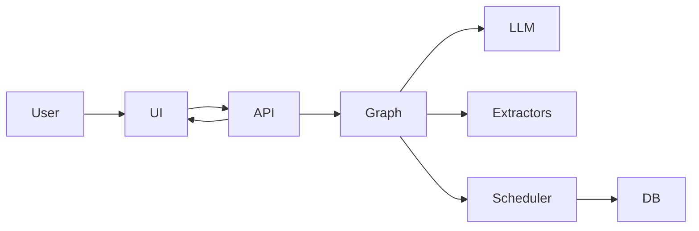

# VoiceAgent — AI Phone Assistant for Clinics

An end-to-end AI voice assistant that handles clinic calls, collects patient information, and books appointments through a real backend system.

## Demo

Coming soon: a short demo video showing a full patient call, real-time assistant responses, appointment booking, and backend updates.

<!-- Demo video will be added here -->

## What It Solves

Clinics regularly miss calls or spend staff time on repetitive appointment requests. A voice assistant can handle those calls, collect the required information, check scheduling availability, and move the booking process forward without relying on a human for every step.

VoiceAgent is designed as a practical prototype for real appointment-based businesses, with actual backend persistence, scheduling logic, and deployment workflows already in place.

## What You Can Do

- Run a natural clinic-call style conversation through a real FastAPI backend
- Collect caller name, phone number, reason for visit, and requested time
- Resolve natural time expressions into structured scheduling data
- Search for available appointment slots
- Hold a slot, confirm it, and persist the booking in PostgreSQL
- Stream assistant responses in real time with low perceived latency
- Use the Streamlit interface to test calls and inspect call outcomes
- Start the full stack with Docker Compose

## Key Features

- State-driven conversation flow instead of a stateless chatbot loop
- LangGraph orchestration across routing, extraction, scheduling, and fallback nodes
- Speak-first, extract-after response design for smoother voice interactions
- Structured JSON outputs for downstream actions and scheduling decisions
- Database-backed scheduling with hold and confirmation logic
- Streaming responses through a Retell-compatible WebSocket path
- Dockerized local deployment with FastAPI, PostgreSQL, Redis, and Streamlit
- Optional HubSpot CRM sync when credentials are configured

## Architecture at a Glance

- **FastAPI backend** for REST and WebSocket APIs
- **Streamlit UI** for conversation testing and call monitoring
- **LangGraph flow** for orchestration and state transitions
- **LLM operator** for generating assistant responses and structured outputs
- **Extractor and scheduler nodes** for info capture and appointment handling
- **PostgreSQL database** for appointments, call logs, and CRM sync events
- **Docker Compose** for local multi-service orchestration



### Workflow Graph

The image below is generated from the current LangGraph workflow in the codebase.


## Tech Stack

- Python
- FastAPI
- Streamlit
- LangGraph / LangChain
- OpenAI API
- PostgreSQL
- Redis
- SQLAlchemy / Alembic
- Docker / Docker Compose
- Optional HubSpot integration

## Quickstart with Docker Compose

Prerequisites:

- Docker
- Docker Compose

```bash
# 1. Create .env.docker
cp .env.docker.example .env.docker

# 2. Edit .env.docker and set OPENAI_API_KEY

# 3. Start services
docker compose up --build
```

Access services:

- Streamlit: `http://localhost:8501`
- FastAPI docs: `http://localhost:8000/docs`
- API status: `http://localhost:8000/`

Notes:

- The Docker image tag used by the compose service is `aminook/voiceagent:0.1.0`
- The container command runs `alembic upgrade head && talk`
- HubSpot sync stays disabled unless `HUBSPOT_ACCESS_TOKEN` is set

## Local Development

Use Docker for the infrastructure services, then run the app locally:

```bash
docker compose up -d db redis
cp .env.example .env
# Edit .env and set OPENAI_API_KEY
uv sync --dev
uv run alembic upgrade head
uv run talk
```

Local URLs:

- FastAPI: `http://localhost:8000`
- Streamlit: `http://localhost:8501`

Run tests:

```bash
uv run pytest
```

## Project Structure

```text
.
├── assets/
│   └── my_graph.png
├── alembic/
│   ├── env.py
│   └── versions/
├── src/voice_agent/
│   ├── core/
│   │   ├── api/v1/
│   │   ├── db/
│   │   ├── graph/
│   │   ├── llm/
│   │   ├── prompts/
│   │   ├── services/
│   │   └── store/
│   ├── frontend/
│   │   ├── pages/
│   │   └── ui/
│   ├── cli.py
│   └── logging.py
├── tests/
│   ├── integration/
│   └── unit/
├── docker-compose.yml
├── dockerfile
├── pyproject.toml
└── README.md
```

## Design Decisions

- **Graph-based agent, not a simple chatbot**: the flow is modeled explicitly across greeting, extraction, hold, booking, fallback, and finalization stages
- **Speak-first then structured JSON**: the assistant can respond naturally while still producing structured data for backend actions
- **Backend owns scheduling logic**: slot validation, conflict handling, and persistence live in the service layer, not only in prompts
- **Explicit state handling for corrections**: the system tracks draft appointment state, held appointments, scheduled appointments, and call state across turns
- **Streaming for low latency**: token streaming and time-to-first-token tracking are built into the runtime

## Use Cases

- Clinic appointment booking
- AI receptionist and inbound call automation
- Scheduling workflows for service businesses
- Front-desk load reduction for repetitive calls
- CRM-connected follow-up workflows when HubSpot sync is enabled

## Roadmap

- [ ] Demo video
- [ ] Hosted demo
- [ ] CRM improvements
- [ ] Better voice integration
- [x] Automated tests
- [ ] Deployment guide

## Portfolio Note

This project demonstrates practical AI engineering work across LLM orchestration, structured extraction, backend integration, explicit state handling, streaming responses, and Docker-based deployment. It is intended to show how a voice assistant can connect model output to real business logic instead of stopping at conversational text.
