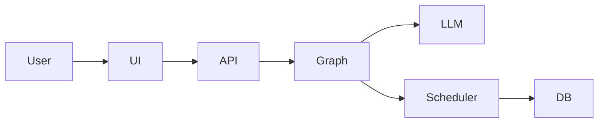

# VoiceAgent — AI Phone Assistant for Clinics

An end-to-end AI voice assistant that handles clinic calls, collects patient information, and books appointments through a real backend system.

## Demo

Coming soon: a short demo video showing a full patient call, real-time assistant responses, appointment booking, and backend updates.

<!-- Demo video will be added here -->

## 🚀 Why This Project

This project demonstrates how modern LLM systems can be integrated with real backend infrastructure to automate business workflows, not just generate text.

It is designed as a foundation for production-ready AI voice assistants.

## What It Solves

Clinics lose revenue and time due to missed calls and manual appointment handling.

This system acts as an AI front-desk assistant that:
- answers calls instantly
- collects required patient information
- schedules appointments automatically
- reduces staff workload and missed bookings

## 🧑‍💼 Use Cases

- Clinics and medical centers
- Appointment-based businesses
- AI receptionist systems
- Customer support automation

## What You Can Do

- Handle real-time patient calls
- Collect and validate booking information
- Schedule appointments with backend integration
- Respond naturally with low latency

## Key Features

- Graph-based conversation orchestration (LangGraph)
- Speak-first, extract-after architecture
- Structured JSON outputs for backend actions
- Persistent state with PostgreSQL
- Streaming responses for improved UX

## 🧠 Design Highlights

- **Speak-first architecture**  
  The assistant responds immediately, then extracts structured data, reducing perceived latency.

- **State-driven conversation**  
  The system tracks partial information and handles corrections naturally.

- **Separation of concerns**  
  Conversation, extraction, and scheduling are handled by different components.

- **Backend-controlled scheduling**  
  Appointment logic is enforced outside the LLM for reliability.

## Architecture at a Glance

- FastAPI backend for API and orchestration
- LangGraph manages conversation flow
- LLM handles natural dialogue + structured output
- PostgreSQL stores appointments and state
- Streamlit UI for interaction




### Workflow Graph

The image below is generated from the current LangGraph workflow in the codebase.


## Tech Stack

- Python
- FastAPI
- Streamlit
- LangGraph / LangChain
- OpenAI API
- PostgreSQL
- Redis
- SQLAlchemy / Alembic
- Docker / Docker Compose
- Optional HubSpot integration

## Quickstart with Docker Compose

Prerequisites:

- Docker
- Docker Compose

```bash
# 1. Create .env.docker
cp .env.docker.example .env.docker

# 2. Edit .env.docker and set OPENAI_API_KEY

# 3. Start services
docker compose up --build
```

Access services:

- Streamlit: `http://localhost:8501`
- FastAPI docs: `http://localhost:8000/docs`
- API status: `http://localhost:8000/`

Notes:

- The Docker image tag used by the compose service is `aminook/voiceagent:0.1.0`
- The container command runs `alembic upgrade head && talk`
- HubSpot sync stays disabled unless `HUBSPOT_ACCESS_TOKEN` is set

## Local Development

Use Docker for the infrastructure services, then run the app locally:

```bash
docker compose up -d db redis
cp .env.example .env
# Edit .env and set OPENAI_API_KEY
uv sync --dev
uv run alembic upgrade head
uv run talk
```

Local URLs:

- FastAPI: `http://localhost:8000`
- Streamlit: `http://localhost:8501`

Run tests:

```bash
uv run pytest
```


## Design Decisions

- **Graph-based agent, not a simple chatbot**: the flow is modeled explicitly across greeting, extraction, hold, booking, fallback, and finalization stages
- **Speak-first then structured JSON**: the assistant can respond naturally while still producing structured data for backend actions
- **Backend owns scheduling logic**: slot validation, conflict handling, and persistence live in the service layer, not only in prompts
- **Explicit state handling for corrections**: the system tracks draft appointment state, held appointments, scheduled appointments, and call state across turns
- **Streaming for low latency**: token streaming and time-to-first-token tracking are built into the runtime


## Roadmap

- [ ] Demo video
- [ ] Hosted demo
- [ ] CRM improvements
- [ ] Better voice integration
- [x] Automated tests
- [ ] Deployment guide

## Portfolio Note

This project demonstrates practical AI engineering work across LLM orchestration, structured extraction, backend integration, explicit state handling, streaming responses, and Docker-based deployment. It is intended to show how a voice assistant can connect model output to real business logic instead of stopping at conversational text.
