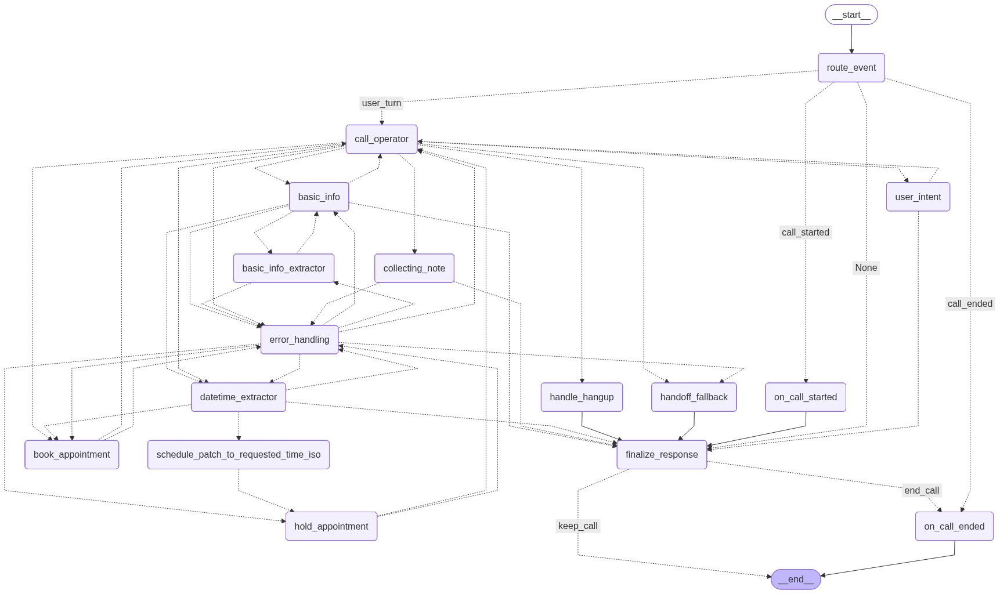

# VoiceAgent

VoiceAgent is a real-time, production-oriented voice assistant for clinics and service businesses. It combines a FastAPI backend, a LangGraph workflow, PostgreSQL-backed scheduling, a Retell-compatible streaming interface, and a Streamlit tester/dashboard for monitoring live conversations.

This repository is focused on real system behavior: persistent appointment state, conflict-safe scheduling, streaming responses, CRM sync, and operational visibility.

## What You Can Do

VoiceAgent is not a demo chatbot. It is built for appointment-heavy workflows where the assistant needs to interact with real systems, not just produce plausible text.

With this system, you can:

- Handle real appointment booking backed by a database instead of fake conversational confirmations
- Interact naturally with users through streaming responses with low time-to-first-token
- Understand and normalize natural time expressions such as `tomorrow morning` or `next Friday at 3`
- Manage the booking lifecycle: collect details, resolve requested times, hold slots, and confirm appointments
- Sync customer interactions and appointments with HubSpot
- Monitor call status, latency, and token usage through API endpoints and the Streamlit dashboard

## Features

### Real-Time Streaming Agent

- Streaming-first response flow for low perceived latency
- Speak-first greeting flow on call start
- Barge-in handling so a new user turn can interrupt an active response cleanly
- Retell-compatible WebSocket interface for voice integrations

### Database-Backed Actions

- PostgreSQL appointment storage with exclusion constraints to prevent overlapping active slots
- Hold and schedule flows backed by persistent records
- Conversation state persisted across turns with Redis and call history written to the database

### Advanced Time Understanding

- Extracts structured scheduling intent from natural language time expressions
- Keeps both raw user phrasing (`requested_time_text`) and normalized ISO time (`requested_time_iso`)
- Rejects invalid slot alignment, enforces business hours, and avoids past bookings

### CRM Integration

- HubSpot sync worker for appointment lifecycle events
- Syncs contacts plus appointment-related deal or ticket records
- Handles retries, delayed sync, and cancellation updates

### Observability and Monitoring

- Per-turn timing and token metrics
- Time-to-first-token tracking for streamed assistant turns
- Call summaries and detailed call views exposed through `/api/v1/calls`
- Streamlit dashboard for inspecting call status, timing, transcripts, and scheduled appointment snapshots

### Developer and Testing Tools

- Streamlit text-based tester for simulating Retell-style conversations
- Integration and unit tests for scheduling, streaming, metrics, and HubSpot sync behavior
- Structured node-level instrumentation inside the LangGraph workflow

### Voice Integration Ready

- Retell-compatible WebSocket endpoint at `/api/v1/retell/llm/{call_id}`
- Built for real call conditions such as interruptions, partial inputs, and incremental streaming

## Architecture at a Glance

VoiceAgent is built around a graph-based orchestration flow where each node handles a focused part of the conversation and booking process.

- **FastAPI backend**: Serves REST and WebSocket APIs under `/api/v1`
- **LangGraph workflow**: Orchestrates routing, operator responses, extraction, holding, booking, and error handling
- **Operator and extraction nodes**: Generate natural responses and structured fields such as name, phone, intent, and time
- **Redis state store**: Keeps live conversation state across turns
- **Database layer**: Stores appointments, call records, and CRM sync events in PostgreSQL
- **Streaming layer**: Streams assistant tokens to the client for low-latency interaction
- **Streamlit frontend**: Provides a tester UI and a calls dashboard

## Workflow Graph

The graph below is the current LangGraph workflow used by the agent runtime. It shows how the system routes events through response generation, extraction, appointment holding, booking, fallbacks, and finalization.



## Tech Stack

- **Backend**: FastAPI, Python 3.11+
- **Agent orchestration**: LangGraph, LangChain
- **LLMs**: OpenAI streaming models with optional Hugging Face support
- **Database**: PostgreSQL
- **State store**: Redis
- **ORM and migrations**: SQLAlchemy, Alembic
- **Frontend**: Streamlit
- **Voice transport**: Retell-compatible WebSocket integration
- **DevOps**: Docker, Docker Compose, `uv`

## Quickstart with Docker Compose

Prerequisites:

- Docker
- Docker Compose

1. Create the Docker env file:

```bash
cp .env.docker.example .env.docker
```

2. Edit `.env.docker` and set at least:

- `OPENAI_API_KEY`
- `HUBSPOT_ACCESS_TOKEN` if you want CRM sync enabled

3. Start the stack:

```bash
docker compose up --build
```

4. Open the services:

- Streamlit tester and dashboard: `http://localhost:8501`
- FastAPI docs: `http://localhost:8000/docs`
- API root/status: `http://localhost:8000/`
- Retell-compatible WebSocket: `ws://localhost:8000/api/v1/retell/llm/<call_id>`

Notes:

- The container starts with `alembic upgrade head && talk`
- PostgreSQL data is persisted in the `voice_agent_pgdata` volume
- HubSpot sync is automatically disabled when `HUBSPOT_ACCESS_TOKEN` is not set

## Run Locally

Prerequisites:

- Python 3.11+
- `uv`
- Local PostgreSQL and Redis, or the Docker services below

Start only the infrastructure services if you want to run the app from your host:

```bash
docker compose up -d db redis
```

Create the local env file:

```bash
cp .env.example .env
```

Install dependencies, run migrations, and start the app:

```bash
uv sync --dev
uv run alembic upgrade head
uv run talk
```

That starts:

- FastAPI on `http://localhost:8000`
- Streamlit on `http://localhost:8501`

## API Surface

Important endpoints:

- `GET /` - service status
- `GET /docs` - Swagger UI
- `GET /api/v1/session/state` - current public session state
- `GET /api/v1/dashboard/session/state` - dashboard session state view
- `GET /api/v1/calls` - recent call summaries with metrics
- `GET /api/v1/calls/{call_id}` - detailed call transcript, metrics, and scheduled appointment snapshot
- `WS /api/v1/retell/llm/{call_id}` - streaming Retell-compatible voice endpoint

## Configuration

The application loads settings from environment variables via Pydantic settings.

Common variables:

- `OPENAI_API_KEY`: required for OpenAI-backed generation
- `SQLALCHEMY_DATABASE_URL`: async PostgreSQL connection string
- `REDIS_URL`: Redis connection string for live conversation state
- `HUBSPOT_ACCESS_TOKEN`: enables the HubSpot sync worker
- `REPLY_PROVIDER`: response provider, for example `openai`
- `REPLY_MODEL`: reply model name
- `REPLY_TEMPERATURE`: model temperature
- `MESSAGE_HISTORY_SIZE`: number of conversation messages retained in context
- `APPOINTMENT_DURATION_MIN`: appointment slot size in minutes
- `OPENING_TIME`: clinic opening time
- `CLOSING_TIME`: clinic closing time
- `LOG_LEVEL`: logging verbosity

See [`src/voice_agent/core/settings.py`](src/voice_agent/core/settings.py) for the full configuration surface.

## Testing

Run the test suite with:

```bash
uv run pytest
```

The repository includes unit and integration coverage for:

- appointment lifecycle and slot handling
- Retell-style streaming and greeting flows
- timing and token metrics
- HubSpot sync behavior
- Streamlit buffering and dashboard state helpers

## For Clients and Freelancing

This project demonstrates production-grade AI engineering beyond a simple chatbot UI.

Key differentiators:

- Real system integration with database-backed booking and CRM sync
- Streaming interaction suitable for live voice calls
- Robust handling of interruptions, ambiguity, and scheduling corrections
- Modular architecture that can be adapted to clinics, service businesses, and other appointment-driven workflows

Common client use cases:

- clinic and healthcare appointment automation
- customer support voice agents
- lead qualification and CRM automation
- scheduling assistants for service businesses
