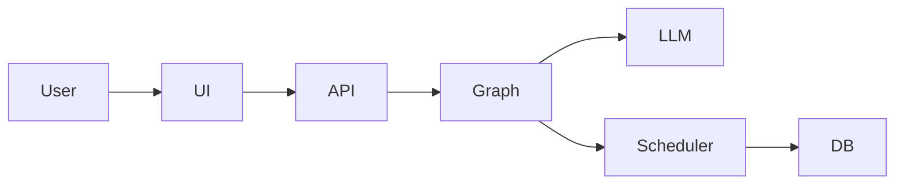

# VoiceAgent — AI Phone Assistant for Clinics

An end-to-end AI voice assistant that handles clinic calls, collects patient information, and books appointments through a real backend system.

## Demo

Coming soon: a short demo video showing a full patient call, real-time assistant responses, appointment booking, and backend updates.

<!-- Demo video will be added here -->

## 🚀 Why This Project

This project demonstrates how modern LLM systems can be integrated with real backend infrastructure to automate business workflows, not just generate text.

It is designed as a foundation for production-ready AI voice assistants.

## 💡 What It Solves

Clinics lose time and revenue handling repetitive phone calls and missed bookings.

VoiceAgent acts as an AI front-desk assistant that:
- answers calls instantly
- collects required patient information
- schedules appointments automatically
- reduces staff workload and missed opportunities

## 🧑‍💼 Use Cases

- Clinics and medical centers
- Appointment-based businesses
- AI receptionist systems
- Customer support automation

## What You Can Do

- Handle real-time patient calls
- Collect and validate booking information
- Schedule appointments with backend integration
- Respond naturally with low latency

## Key Features

- Graph-based conversation orchestration (LangGraph)
- Speak-first, extract-after architecture
- Structured JSON outputs for backend actions
- Persistent state with PostgreSQL
- Streaming responses for improved UX

## 🧠 Design Highlights

- **Instant response (speak-first)**  
  The assistant replies immediately, then extracts structured data — reducing perceived latency.

- **State-aware conversations**  
  Tracks partial information and handles corrections naturally.

- **Reliable scheduling logic**  
  All appointment decisions are handled by the backend, not the LLM.

- **Modular architecture**  
  Conversation, extraction, and scheduling are separated for robustness.

## Architecture at a Glance

- FastAPI backend for API and orchestration
- LangGraph manages conversation flow
- LLM handles natural dialogue + structured output
- PostgreSQL stores appointments and state
- Streamlit UI for interaction




### Workflow Graph

The image below is generated from the current LangGraph workflow in the codebase.


## Tech Stack

- Python
- FastAPI
- Streamlit
- React + Vite + TypeScript
- LangGraph / LangChain
- OpenAI API
- PostgreSQL
- Redis
- SQLAlchemy / Alembic
- Docker / Docker Compose
- Optional HubSpot integration

## Frontend UIs

This repository now includes two UI paths:

- `frontend/react` — the recommended demo UI. This is the new Vite + React + TypeScript dashboard for live streaming calls, appointment state, metrics, timeline events, logs, and recent saved calls.
- `src/voice_agent/frontend` — the existing Streamlit UI, which remains the canonical Streamlit runtime path so the current `talk` command and Streamlit multipage routing keep working.

There is also a small documentation wrapper at `frontend/streamlit` so both frontends are grouped under a shared top-level `frontend/` directory without breaking the existing Streamlit launch path.

## Quickstart with Docker Compose

Prerequisites:

- Docker
- Docker Compose

```bash
# 1. Create .env.docker
cp .env.docker.example .env.docker

# 2. Edit .env.docker and set OPENAI_API_KEY

# 3. Start services
docker compose up --build

# Optional: run the React dev server as well
docker compose --profile react up --build
```

Access services:

- FastAPI: `http://localhost:8000`
- FastAPI docs: `http://localhost:8000/docs`
- Streamlit UI: `http://localhost:8501`
- React UI (optional `react` profile): `http://localhost:5173`

Notes:

- The Docker image tag used by the compose service is `aminook/voiceagent:0.1.0`
- The container command runs `alembic upgrade head && talk`
- HubSpot sync stays disabled unless `HUBSPOT_ACCESS_TOKEN` is set

## Local Development

Use Docker for the infrastructure services, then run the app locally:

```bash
docker compose up -d db redis
cp .env.example .env
# Edit .env and set OPENAI_API_KEY
uv sync --dev
uv run alembic upgrade head
```

Local URLs:

- FastAPI: `http://localhost:8000`
- Streamlit UI: `http://localhost:8501`
- React UI: `http://localhost:5173`

### Run the Backend

```bash
uv run uvicorn voice_agent.core.api.v1.fastapi_app:fastapi_app --reload
```

### Run the Streamlit UI

Recommended if you want the original reference UI:

```bash
uv run streamlit run src/voice_agent/frontend/streamlit_app.py
```

Or run both the FastAPI backend and Streamlit together:

```bash
uv run talk
```

### Run the React UI

The React frontend lives in `frontend/react`.

```bash
cd frontend/react
cp .env.example .env
npm install
npm run dev
```

Required React environment variables:

- `VITE_API_BASE_URL` — FastAPI base URL, for example `http://localhost:8000/api/v1`
- `VITE_WS_URL` — live websocket base URL, for example `ws://localhost:8000/api/v1/live/ws`

Package scripts:

- `npm run dev`
- `npm run build`
- `npm run preview`

## Recommended Demo UI

Use the React UI in `frontend/react` for demos.

Use the Streamlit UI when you want the original reference implementation or need to compare behavior against the current baseline.

## Backend Notes for the React UI

- Live chat/call simulation uses the websocket adapter at `/api/v1/live/ws/{call_id}`
- Recent calls and detail pages use the existing REST endpoints at `/api/v1/calls` and `/api/v1/calls/{call_id}`
- The React app only displays fields already exposed by the backend; unavailable fields render as empty states rather than invented data

Run tests:

```bash
uv run pytest
```


## Design Decisions

- **Graph-based agent, not a simple chatbot**: the flow is modeled explicitly across greeting, extraction, hold, booking, fallback, and finalization stages
- **Speak-first then structured JSON**: the assistant can respond naturally while still producing structured data for backend actions
- **Backend owns scheduling logic**: slot validation, conflict handling, and persistence live in the service layer, not only in prompts
- **Explicit state handling for corrections**: the system tracks draft appointment state, held appointments, scheduled appointments, and call state across turns
- **Streaming for low latency**: token streaming and time-to-first-token tracking are built into the runtime


## Roadmap

- [ ] Demo video
- [ ] Hosted demo
- [ ] CRM improvements
- [ ] Better voice integration
- [x] Automated tests
- [ ] Deployment guide

## Portfolio Note

This project demonstrates practical AI engineering work across LLM orchestration, structured extraction, backend integration, explicit state handling, streaming responses, and Docker-based deployment. It is intended to show how a voice assistant can connect model output to real business logic instead of stopping at conversational text.
